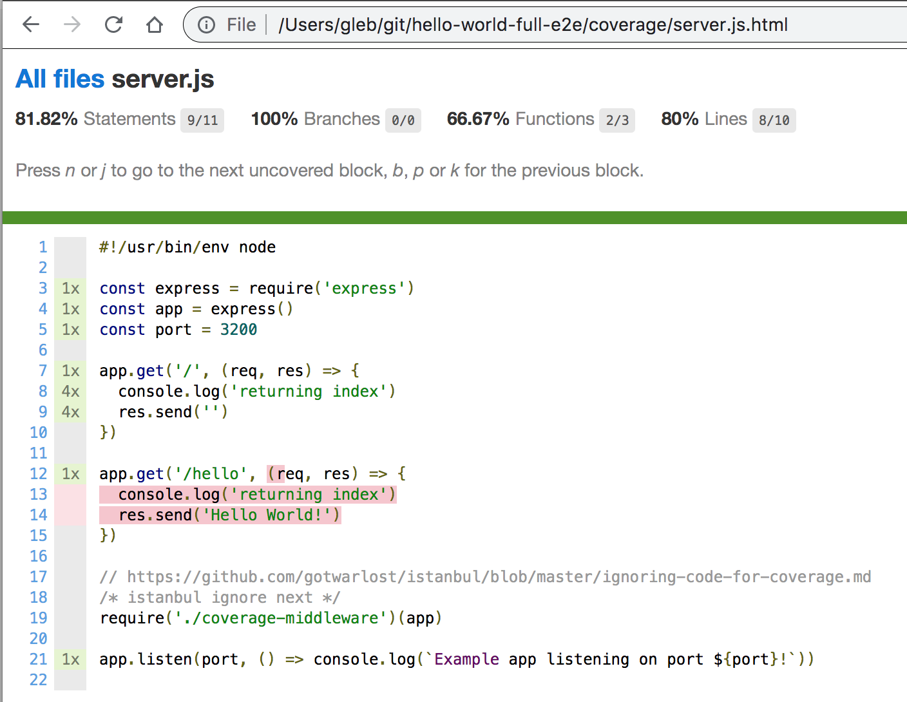
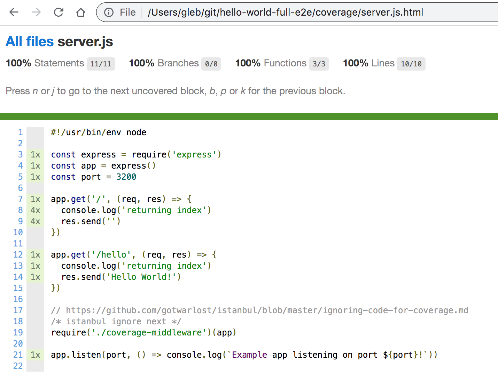

# hello-world-full-e2e [](https://circleci.com/gh/bahmutov/hello-world-full-e2e/tree/master)
> Proof of concept collecting code coverage from the backend server while running Cypress e2e tests

Read [Cypress Code Coverage guide](https://on.cypress.io/code-coverage)

## Server code coverage

If the "normal" server is started with just "node ./src/server.js", then to instrument the server code using [nyc](https://github.com/istanbuljs/nyc) is simply "nyc --silent node ./src/server.js".

## Backend coverage without API call

If the end-to-end test does not call the API method

```js
it('works', () => {
  // cy.request('/hello')
})
```

Then the backend source shows it has not been executed



If we execute the backend call from the Cypress test

```js
it('works', () => {
  cy.request('/hello')
})
```

Then the coverage shows the code has been executed


